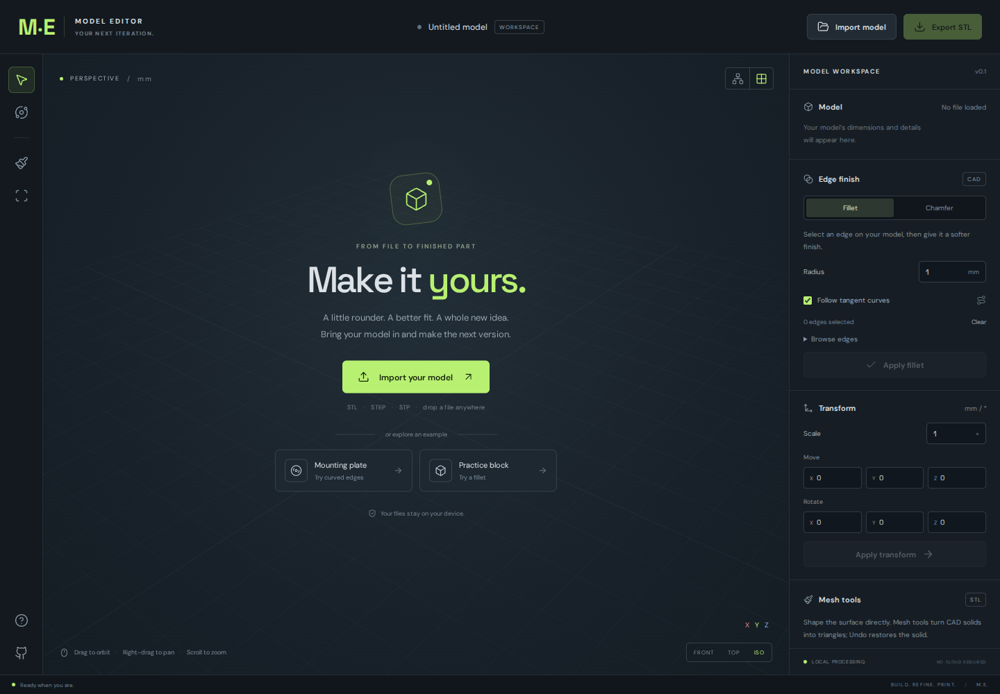

# M.E. — Model Editor

A browser-based editor for the next iteration of a 3D printed part. Import an STL or STEP, orbit the model, edit it, and download a new binary STL. Files and geometry processing stay on the user's device. The production app is a static site that runs on GitHub Pages, including its WebAssembly CAD kernel and fonts; there is no backend or runtime CDN dependency.



## Run locally

Requires Node.js 22.12 or newer.

```sh
npm ci
npm run dev
```

Open the address printed by Vite, normally `http://localhost:5173`. The server listens on all network interfaces, so devices on the same local network can open `http://<server-LAN-IP>:5173`.

```sh
npm test                 # geometry and tangent-chain tests
npm run build            # static output in dist/
npm run preview          # view the built site
npx playwright install chromium
npm run test:e2e         # actual browser tests against dist/ under /M.E./
```

If you already have a compatible Chromium installed, set `PW_CHROMIUM_EXECUTABLE` to its absolute executable path for the browser tests. Open the app over HTTP(S), rather than `file://`.

## What you can do

- Import binary or ASCII STL, STEP/STP solid models, and `.me` projects. Drag a file onto the workspace or use Import model.
- Orbit, pan, zoom, fit the model, switch to top/front/isometric views, and inspect a wireframe or grid. Model units are millimetres; STL has no unit metadata, so its coordinates are assumed to be mm.
- Select CAD edges in the viewport or the edge list, follow connected tangent curves, and apply a true solid fillet or symmetric chamfer using OpenCascade. STEP geometry remains a boundary representation, rather than becoming a mesh at import.
- Attempt STL-to-solid conversion for suitable closed mechanical meshes. Triangles are sewn into a shell, coplanar surfaces are unified, and the resulting solid is validated. This has been tested with a triangulated block, including fillet and chamfer after conversion.
- Scale uniformly, move along X/Y/Z, and rotate around the model centre. Transforms modify exported coordinates.
- Smooth connected mesh vertices, refine triangles, and raise or lower local surfaces with a brush. Shared mesh vertices stay welded; open boundaries stay fixed during smoothing/sculpting. Shift makes the brush push inward.
- Undo/redo up to 16 states, subject to a 96 MB mesh-history budget. A new import starts a new history.
- Check open edges, non-manifold edges, and degenerate triangles.
- Export binary STL, export STEP for solids, or save an `.me` project that retains CAD geometry and the current mesh. Projects store the current model; they do not store the undo history or camera.

Try the **Mounting plate** example for circular edges, or **Practice block** for a simple fillet. Keyboard shortcuts: V selects edges, O orbits, B selects the brush, F fits, Escape clears selection, Ctrl/Cmd+Z undoes, Ctrl/Cmd+Shift+Z redoes.

## GitHub Pages

The workflow in [`.github/workflows/pages.yml`](.github/workflows/pages.yml) builds the app and deploys `dist/` when `master` is pushed. In the repository, choose **Settings → Pages → Source → GitHub Actions** before deploying. GitHub's [custom-workflow documentation](https://docs.github.com/en/pages/getting-started-with-github-pages/using-custom-workflows-with-github-pages) describes the required repository setting and deployment permissions.

For this repository, the expected site address after a successful deployment is `https://savusavu.github.io/M.E./`. This project uses relative asset URLs and a single-page workspace with no path-based routes. The production browser suite serves the built app at `/M.E./` and exercises the worker and WASM paths there. You can also publish the contents of `dist/` with any static HTTP server. The source directory itself needs a build first.

## Current limits

This is an initial working editor, not a replacement for a full parametric CAD system.

- STL triangles do not preserve the original curves or design history. Solid conversion does not recover analytic cylinders, splines, or the original CAD features. STEP is the preferred source for accurate curved edge edits.
- Imports and mesh edits are limited to **600,000 triangles** and **80 MB files**. STL solid conversion has an additional **20,000 triangle** ceiling and requires closed topology. A dense scan or organic mesh should use mesh tools, rather than conversion.
- OpenCascade can reject a fillet or chamfer if the requested size conflicts with surrounding geometry. Failed edits leave the current model intact; try a smaller radius or a different selection. Some STEP files containing only surfaces are unsupported.
- Mesh smoothing can shrink a model or soften intended corners. Mesh sculpting can create intersecting surfaces with excessive depth; review the exported STL in your slicer. Diagnostics check edge incidence and degenerate triangles, not self-intersections, wall thickness, support requirements, or manufacturing suitability.
- Mesh tools tessellate a CAD solid and switch it into mesh mode. Undo restores the solid. Save a project before leaving the page or replacing a model; there is no autosave.
- Cancel terminates the modeling worker and restores the last displayed model, including its CAD representation. Earlier undo history is cleared. Large CAD computations can still exceed available browser memory.
- The CAD WASM asset is about **23 MB uncompressed** and loads on the first CAD operation. It uses the single-thread build, so GitHub Pages needs no special cross-origin isolation headers.
- There are no sketch constraints, general surface reconstruction, booleans, hole repair, multi-object assembly editing, or face-extrusion tools in this version.

## Architecture and BumpMesh analysis

[Architecture and reference analysis](docs/architecture.md) explains why this project uses Three.js plus a worker running Replicad/OpenCascade rather than directly forking BumpMesh. BumpMesh is an excellent reference for a local import/edit/export workflow, but its texture displacement pipeline and STEP tessellation serve a different editing purpose.

## Licenses

M.E.'s original application code is MIT licensed. No BumpMesh source or assets are copied into this project. Dependency notices and licenses, including LGPL terms for the CAD kernel, are included in [`public/licenses/`](public/licenses/) and the built site. See [`THIRD_PARTY_NOTICES.md`](THIRD_PARTY_NOTICES.md).
