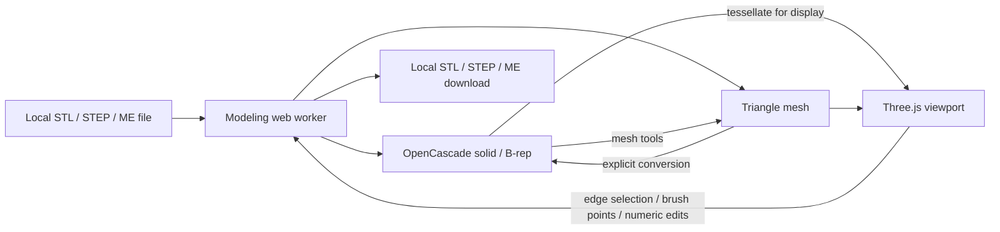

# Architecture and reference analysis

## BumpMesh / stlTexturizer

Reference inspected: [CNCKitchen/stlTexturizer](https://github.com/CNCKitchen/stlTexturizer), at commit `ee02c390484d7d47c9023470380cba9a58f88299`. The reference checkout is separate from M.E.; no code, textures, artwork, or branding from it is included here.

BumpMesh already solves several relevant problems: browser-local model loading, a Three.js orbit/pan/zoom viewport, masking and surface interaction, worker-based processing, diagnostics, undo/redo, and downloads of printable meshes. Its primary pipeline subdivides triangles, displaces them using textures, optionally decimates them, and writes STL/3MF. Its newer STEP import uses meshStep to tessellate B-rep geometry into triangle positions and normals.

That makes it a useful reference for M.E.'s import → inspect → edit → export interaction. Its worker lifecycle and mesh processing modules would also be useful if M.E. develops a displacement-texture feature in the future.

It is not the best geometry foundation for accurate CAD fillets and chamfers. Once STEP surfaces have been tessellated, the exact curves and solid topology needed for CAD edge operations are no longer the working representation. A fork would therefore still need a second CAD pipeline and a substantially different UI. BumpMesh uses AGPL-3.0-only, which would also determine the licensing obligations of reused application source.

Decision: build an original M.E. workspace, use Three.js for interaction, and preserve STEP solids with Replicad/OpenCascade. Borrow interaction ideas, not source code. This keeps the editor focused on geometric iteration and its runtime fully static.

## Data flow

`src/main.js` owns the UI, file input, download links, and worker request lifecycle. `src/viewer.js` owns the WebGL scene, camera, orbit controls, CAD edge raycasting, and brush hit positions. `src/editor.worker.js` owns the authoritative current geometry and bounded undo history. `src/mesh.js` implements STL IO, welded topology, transforms, smoothing, subdivision and sculpting. `src/chains.js` extends a selection only across shared endpoints with compatible tangents.

CAD solids live in the worker. Replicad wraps the OpenCascade kernel's STEP import/export, solid edits, sewing, tessellation and geometry serialization. STEP assemblies are displayed/edited as one model; this version does not expose their individual parts. Operations produce a candidate model, validate it, generate its display data, and only then append it to history. Failed candidates do not replace the prior state.

STL begins as a triangle mesh. Solid conversion checks closed topology, uses OpenCascade's STL reader, sews facets, unifies coplanar faces and edges, fixes shell orientation through solid construction, and checks the final B-rep. Curved STL facets stay facets. High triangle counts are restricted because representing each facet as a CAD surface costs substantially more than rendering it.

Mesh edits weld matching positions into a shared vertex graph before moving points. Subdivision splits all triangles consistently. The brush weights nearby vertices and displaces them along area-weighted normals. The viewport receives fresh mesh data after each completed edit; export uses that same authoritative geometry.

## Hosting

Vite bundles JavaScript, worker modules, local fonts and the single-thread OpenCascade WASM. All generated asset URLs are relative. GitHub Pages only serves files; it does not perform CAD operations. The static production tests mount the build under `/M.E./` and check that no asset requests go to third-party hosts.

## Next development priorities

1. Larger and more varied STL/STEP regression fixtures, including multiple shells and tricky concave geometry.
2. Preview/apply/cancel for edge edits and clearer identification of invalid candidate edges.
3. Mesh boolean operations and capped cuts using a dedicated robust mesh kernel.
4. Coplanar region reconstruction with explicit tolerance controls and decimation before solid conversion.
5. Parametric primitive creation, face selection and constrained sketch/extrusion tools.
6. Autosave, per-part assemblies, mesh repair, and self-intersection checks.
